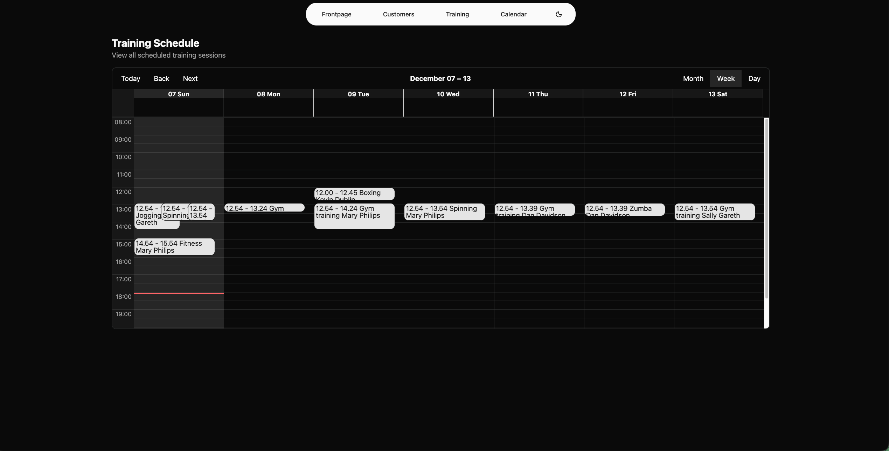
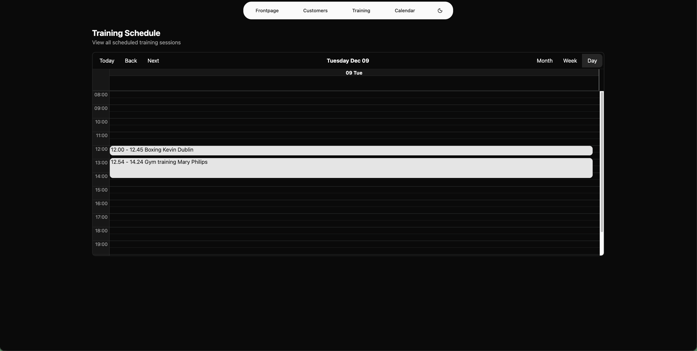
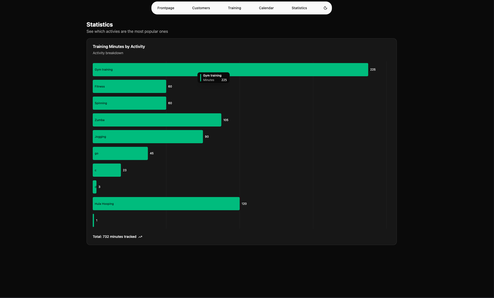

# Personal Trainer Application

Web application for managing customers, training session and schefules for personal trainers. Built as a school project for Haaga-Helia University of Applied Sciences front end course.

The project is hosted at: https://personaltrainer.joniharju.fi

## Features

### Customer Management

- Show all the customers in a data table that supports sorting and filtering.
- Add, Edit and Delete customers.
- Download all customer information as CSV file.

### Training Management

- View all training sessions in a data table that supports sorting and filtering
- Add and delete training sessions.

### Calendar Schedule

- Displays all the training sessions in a large calendar view.
- Supports month, week and day views of the calendar.

### Statistics

- Displays visual breakdown of different training activities by minute
- Tracks the total minutes that have been ordered across all the training sessions

### General features

- Dark and light mode. Toggle between dark and light mode or use your system preference theme
- Fully responsive for mobile users
- Has 100% navigation support via keyboard controls

## Tech Stack

| Feature                | Library/Tool                                                        |
| ---------------------- | ------------------------------------------------------------------- |
| **Frontend Framework** | [React](https://reactjs.org/)                                       |
| **Routing**            | [React Router](https://reactrouter.com/)                            |
| **Build Tool**         | [Vite](https://vite.dev/)                                           |
| **Styling**            | [Tailwind CSS](https://tailwindcss.com/)                            |
| **UI Components**      | [shadcn/ui](https://ui.shadcn.com/)                                 |
| **Data Fetching**      | [TanStack Query](https://tanstack.com/query/latest)                 |
| **Data Tables**        | [TanStack Table](https://tanstack.com/table/latest/)                |
| **Charts**             | [Recharts](https://recharts.github.io/)                             |
| **Calendar**           | [react-big-calendar](https://github.com/jquense/react-big-calendar) |
| **Date Handling**      | [Luxon](https://moment.github.io/luxon/)                            |
| **CSV Export**         | [react-csv](https://github.com/react-csv/react-csv)                 |
| **Linting**            | [ESLint](https://eslint.org/)                                       |
| **Utilities**          | [Lodash](https://lodash.com/)                                       |

Additionally some packages like **sonner** and **react-hook-form** have been installed along the shadcn components.

## Project Structure

```
src/
├── App.tsx                 # Main app component with routing
├── main.tsx                # Application entry
├── index.css               # Main CSS file which contains the theme setup
├── shadcn-big-calendar.css # CSS file for the calendar component
├── api/                    # API functions
│   ├── customers.ts
│   └── trainings.ts
├── components/             # React components
│   ├── ui/                 # /ui is reserved for shadcn components
│   ├── Customers.tsx
│   ├── Training.tsx
│   ├── CalendarView.tsx
│   ├── Statistics.tsx
│   └── ...
├── interfaces/             # TypeScript interfaces
└── lib/                    # Utilities and table configs
```

### Setup

1. Clone the repository

```bash
git clone https://github.com/JonipHarju/personal-trainer-app-haaga-helia-front-end-course
```

2. Enter the directory

```bash
cd personal-trainer-app
```

3. Install dependecies

```bash
npm install
```

4. Tetup environment varialbes
   - create a .env file in the root of your directory and enter your API url

```env
VITE_API_URL=your_url_here

```

5. Start the dev server

```bash
npm run dev
```

- Or alternatively build the project with

```bash
npm run build
```

# part 1

Part 1 return of the exercise has the following features.

- A customers and training page.
- Navigation component between these pages
- A table component on both pages that lists the requirement information.
- Table includes filtering and sorting
- A dark and light mode support

## Screenshot of the customers and training pages below

### Customers


### Customers dark


### Trainings


### Trainings dark


# part 2

Part 2 adds CRUD functionalities for customers and trainings.

- Create, update and delete customers
- Create and Delete trainings
- All deletes require user confirmation
- Add toasts that message how the CRUD action went

## Screenshots of the part 2 functionalities

I only added darkmode screenshots here since the functionality is allready demonstrated above in part 1 screenshots and there has not been any changes to that.

### Customer table with crud operations


### Add new customer dialog


### Edit customer dialog


### Delete customer dialog


### Training page with create and delete operations


### Add new training dialog


### Add new training date picker open


### Delete training dialog


# part 3

Part 3 adds ability to export customers to CSV file and adds a calendar page.

## Screeshots of the calendar page views

### Month view


### Week view



### Day view



# part 4

Part 4 adds the statistics route, which displays how many minutes have been reserved by each training activity


