# part 1

Part 1 return of the exercise has the following features.

- A customers and training page.
- Navigation component between these pages
- A table component on both pages that lists the requirement information.
- Table includes flitering and sorting
- A dark and light mode support

## Screenshot of the customers and training pages below

### Customers

### Customers dark

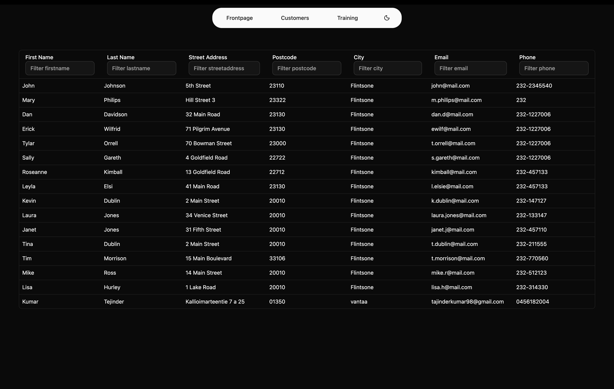

### Trainings

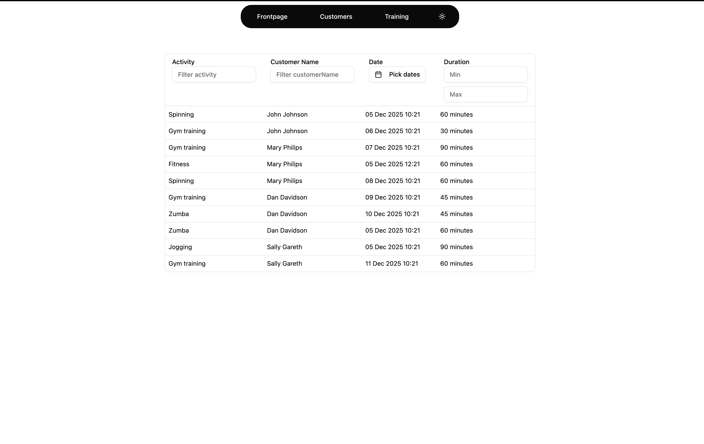

### Trainings dark

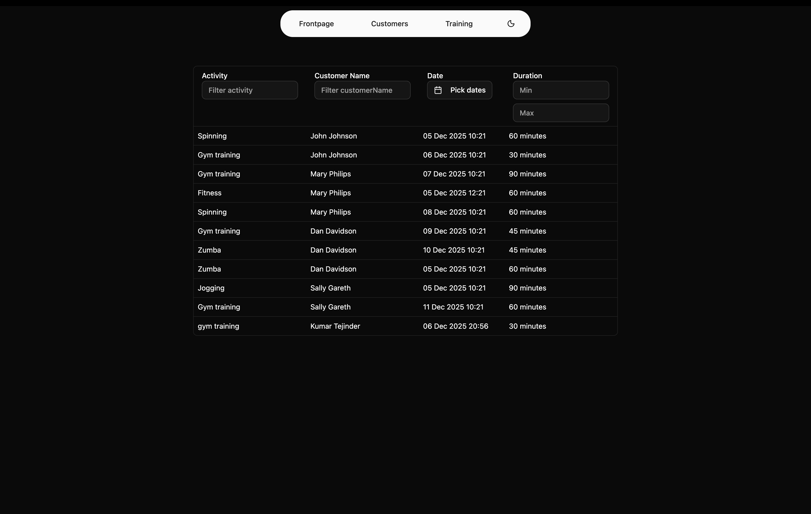

# part 2

Part 2 adds CRUD functionalities for customers and trainings.

- Create, update and delete customers
- Create and Delete trainings
- All deletes require user confirmation
- Add toasts that message how the CRUD action went

## Screenshots of the part 2 functionalities

I only added darkmode screenshots here since the functionality is allready demonstrated above in part 1 screenshots and there has not been any changes to that.

### Customer table with crud operations

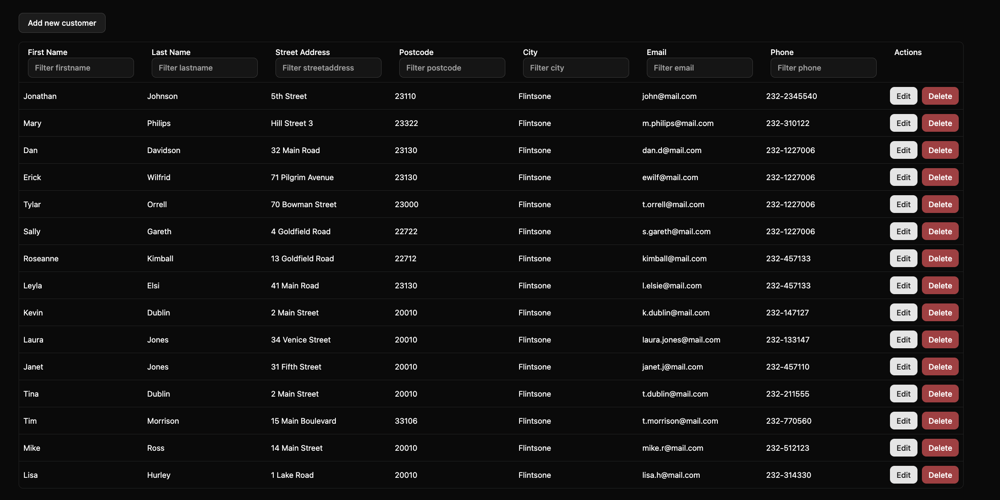

### Add new customer dialog

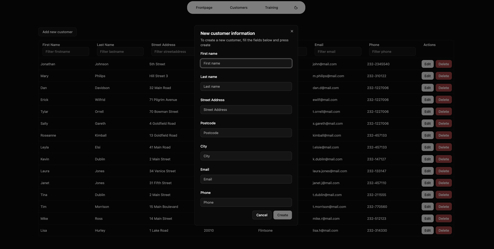

### Edit customer dialog

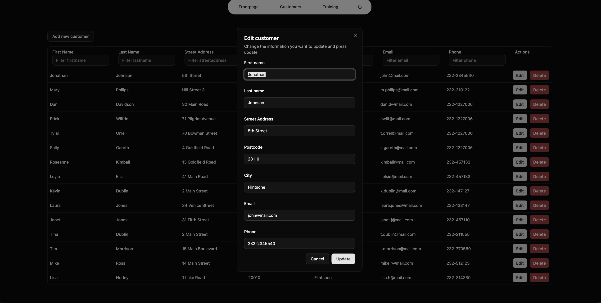

### Delete customer dialog

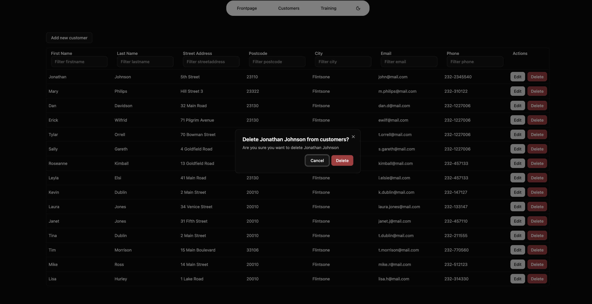

### Training page with create and delete operations

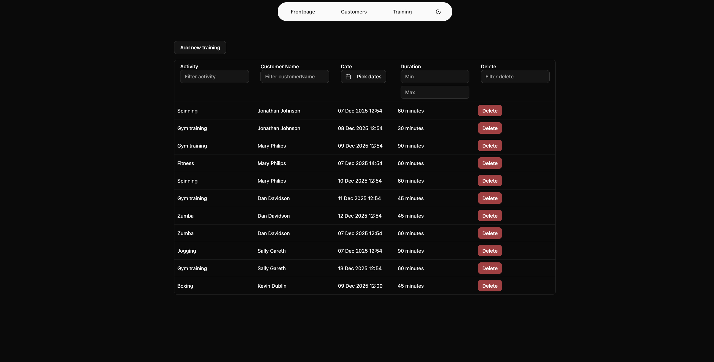

### Add new training dialog

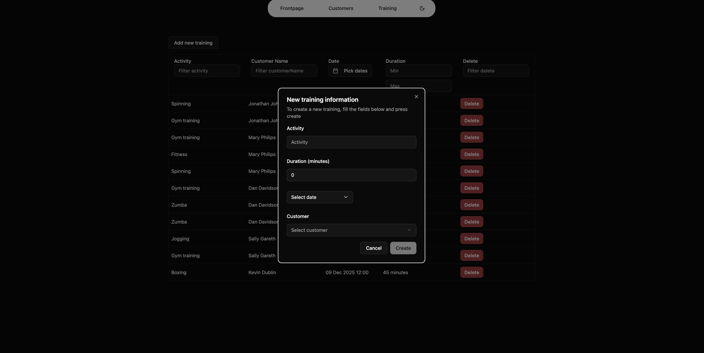

### Add new training date picker open

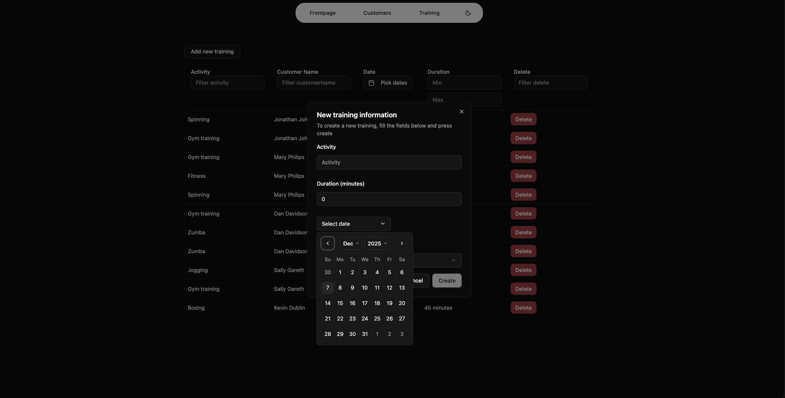

### Delete training dialog

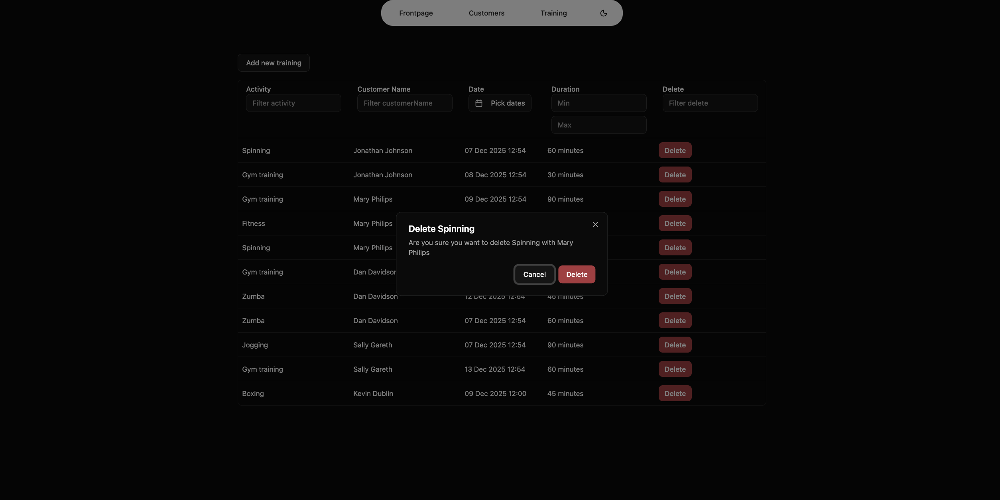
